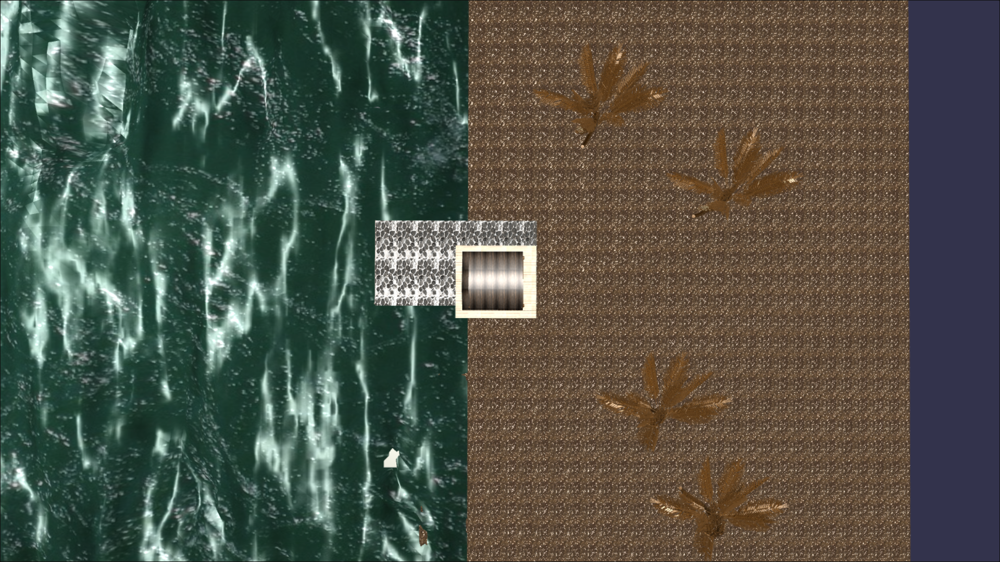
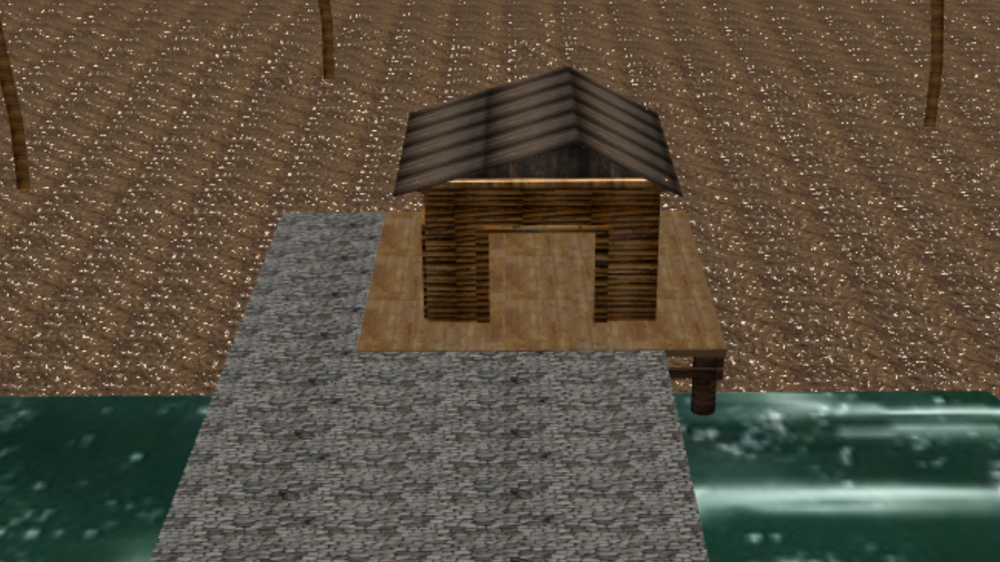
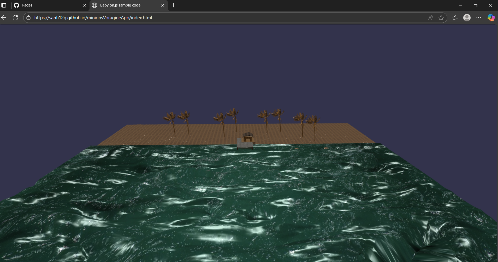

# minionsVoragineApp 

### El archivo codeSketch.js es para el codigo que se implementa en babylon.js en el playground para trabajarlo desde ahi
### El index.html contiene la escena corriendo del mundo terminado implementado para webGL en Babylon.js playground
### Nota: para correr el codigo hay que correr este link https://santi12g.github.io/minionsVoragineApp/index.html

# Seccion de capturas de la escena en babylon.js
## Captura 1

## Captura 2

## Captura 3

